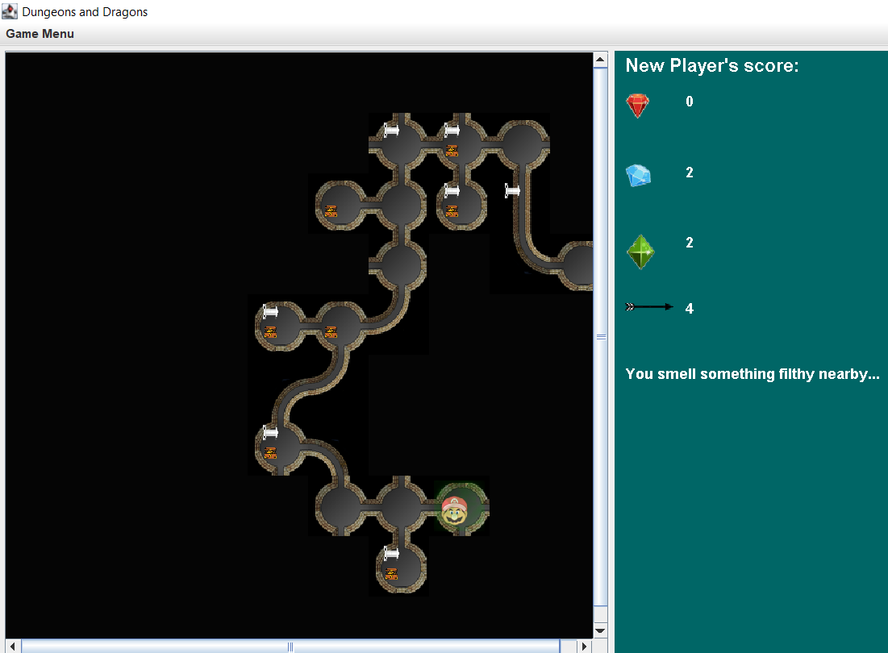

# Dungeons & Dragons

### Overview

A game where a player can navigate their way through a dungeon, collect treasures, and slay 
monsters. The dungeon consists of caves and tunnels. The player can find and collect arrows in the 
game. The arrows can be used to kill monsters. The monster can kill the player, if the player visits 
its cave. The player starts at a random cave in the dungeon and has the goal of reaching a random 
end cave. The player also starts with 3 arrows. If the player dies, the game ends and player loses. 
When the player reaches the end cave, they have an option to end the game. If the player ends the 
game here, the player wins.

### Features

- The program provides the feature to create a dungeon of specified size from settings menu.
- It allows the user to decide the density of treasures and arrows in the dungeon by taking
  percentage of caves containing the collectibles from settings menu.
- It also asks the user to give the degree of connectivity and the name of the player in settings.
- The user can provide the number of monsters to be added in the dungeon.
- The user can opt for the dungeon to be a wrapping one.
- The program creates a dungeon and allows the user to navigate as the player using a graphical
  interface.
- During the game, the player can move between caves and tunnels, collect treasures, collect arrows,
  and shoot arrows to kill monsters.
- The user can quit the game, restart the game or start a new game using the menu.

### Gameplay:

### How to run:

To run the jar, use the following command on cmd:
##### Command-line interface:
> java -jar "path to jar file" -c
##### Graphical user interface:
> java -jar "path to jar file" -g
##### Runs on default mode:
> java -jar "path to jar file"

#### The jar needs to be in the res/ directory to run.

### How to use the program:

User can play the game using command line or graphical interface.

#### Command line controls:

- M - Move player.
  - N - Move player north of current location by 1 unit.
  - S - Move player south of current location by 1 unit.
  - W - Move player west of current location by 1 unit.
  - E - Move player east of current location by 1 unit.
- P - Pick up treasure/ arrows.
  - treasure - pick up treasure.
  - arrow - pick up arrows.
- S - Shoot arrow.
  - N - Shoot an arrow in the north direction.
  - S - Shoot an arrow in the south direction.
  - W - Shoot an arrow in the west direction.
  - E - Shoot an arrow in the east direction.
  - Numbers (1-5) - distance as measured by number of caves.
- Q - Quit the game.

#### Graphical interface controls:
- Use arrow keys to move the player.
- Use "S" + arrow key to shoot arrow in a particular direction.
- Use "T" for picking up treasure.
- Use "W" for picking up arrow.
- Use "Game Menu" or "Alt + F" to interact with the menu.
- Click on the accessible location to move using mouse.